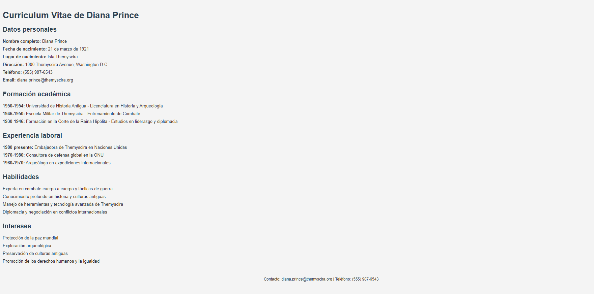

# Reto 1.6: Listas
Nombre y Apellidos: Pablo Rodríguez Crespo
URL del repositorio de gitlab: https://github.com/Pablosax9/ODAW2_RETO.1.6-Listas.git
## Instrucciones:
A partir del texto que se te proporciona, debes crear una página web que tenga el mismo aspecto que la siguiente imagen:
Ejemplo final:

1. Uso de etiquetas semanticas.
2. Uso de listas.
3. Uso de encabezados.
4. Uso del atributo adecuado para marcar enfasis.
